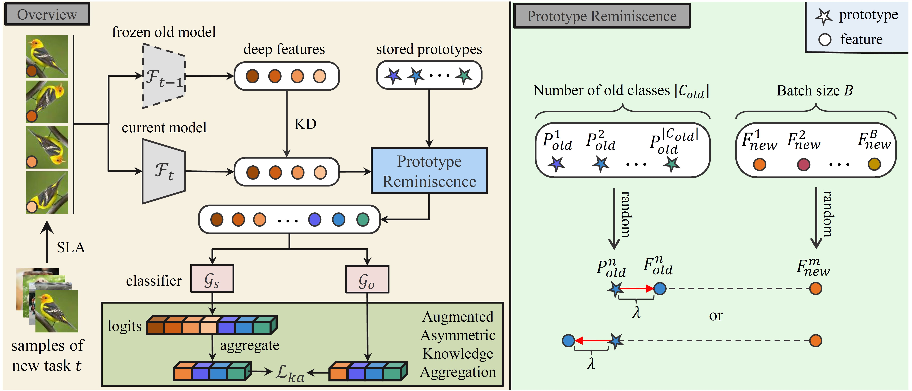

# PRAKA - Official PyTorch Implementation


### [ICCV 2023] Prototype Reminiscence and Augmented Asymmetric Knowledge Aggregation for Non-Exemplar Class-Incremental Learning

[Wuxuan shi](https://scholar.google.com/citations?user=p5jF5dAAAAAJ&hl=zh-CN&oi=ao), [Mang Ye](https://marswhu.github.io/)*

[Paper](https://openaccess.thecvf.com/content/ICCV2023/papers/Shi_Prototype_Reminiscence_and_Augmented_Asymmetric_Knowledge_Aggregation_for_Non-Exemplar_Class-Incremental_ICCV_2023_paper.pdf) | [Supp](https://openaccess.thecvf.com/content/ICCV2023/supplemental/Shi_Prototype_Reminiscence_and_ICCV_2023_supplemental.pdf)

## Usage

* Training on CIFAR-100 dataset:

```
$ python Cifar100/main.py --gpu 0 --task_num 10 --fg_nc 50 --root [your dataset path]
```
Arguments you can freely tweak given a dataset:

* --gpu: which gpu used
* --task_num: number of tasks for incremental learning
* --fg_nc: number of classes of initial tasks
* --root: path of datasets (replace [your dataset path] with your own dataset root)


## Citation
If you use this code for your research, please consider citing:

```
@inproceedings{shi2023prototype,
  title={Prototype Reminiscence and Augmented Asymmetric Knowledge Aggregation for Non-Exemplar Class-Incremental Learning},
  author={Shi, Wuxuan and Ye, Mang},
  booktitle={Proceedings of the IEEE/CVF International Conference on Computer Vision},
  pages={1772--1781},
  year={2023}
}
```

## Acknowledgement

This work is partially supported by the Key Research and Development Program of Hubei Province (2021BAA187), National Natural Science Foundation of China under Grant (62176188), Zhejiang lab (NO.2022NF0AB01), the Special Fund of Hubei Luojia Laboratory (220100015) and CAAI-Huawei MindSpore Open Fund.

**We thank the following repos providing helpful components/functions in our work.**
* [PASS](https://github.com/Impression2805/CVPR21_PASS)
